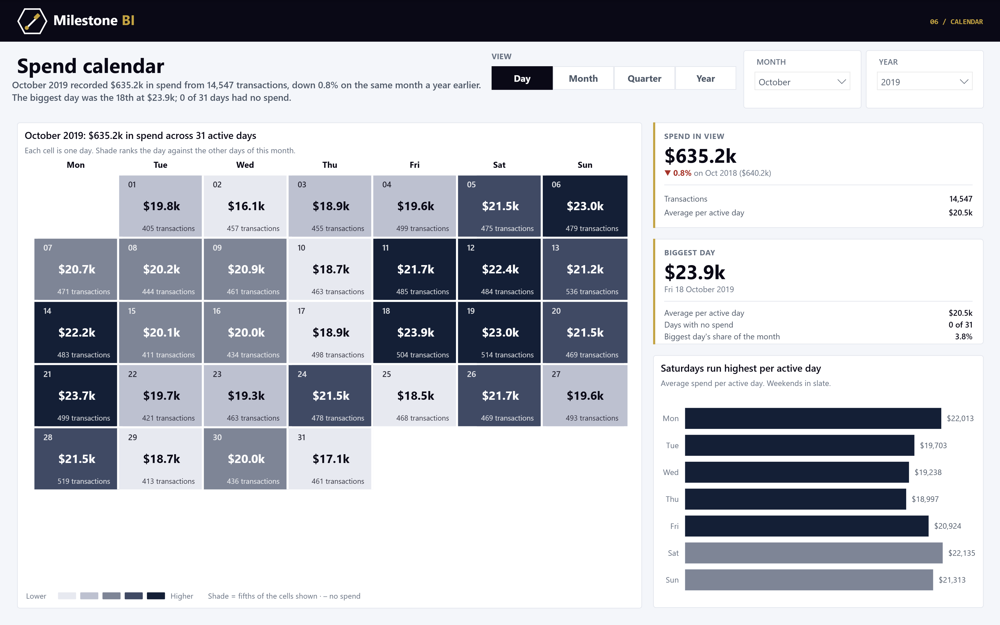

# Card transactions & fraud, 2010 to 2019

A Power BI semantic model and report built on a decade of US card transactions: what was
spent, what the bank declined, and what turned out to be fraud. Everything here is generated
from source — the star schema, the TMDL model and the PBIR report each come out of a script in
`etl/`, and every headline figure is recomputed in pandas and diffed against the live model
before it is drawn.

**Report:** five pages — Overview, Channels, Fraud, Customers, Geography.
**Model:** 10 tables, 77 columns, 48 measures, 8 relationships, 18 partitions.

---

## The data

[💳 Financial Transactions Dataset: Analytics](https://www.kaggle.com/datasets/computingvictor/transactions-fraud-datasets)
on Kaggle — 13,305,915 transactions, 6,146 cards, 2,000 clients, 109 merchant category codes
and a partial set of fraud labels, created by **CaixaBank Tech for the 2024 AI Hackathon** and
published under **Apache 2.0**. The licence is why the derived data in `data/` can live in a
public repo and why the model refreshes in the Power BI Service with no gateway: every
partition is a plain `raw.githubusercontent.com` URL.

The source is synthetic. It behaves like a card book in most respects and conspicuously does
not in one (see *the chip switch*, below).

### What is in `data/`, and what is not

The fact is a **client sample**: 160 clients drawn with a fixed seed, with every one of their
transactions kept at full transaction grain — 1,682,640 rows across 640 cards.

The whole file is 1.26 GB and cannot go in a repo, and every aggregate grain that keeps both
the merchant category and the card link runs past five million rows. Sampling clients keeps a
single clean star schema and leaves every question answerable; it costs the ability to quote
population totals, so the report never does. `data/quality_report.json` records both the
population figures and the sample's.

Three columns never leave the ETL: `card_number`, `cvv` and `expires` on the card, and the
street address on the client. Dropping them in the extract rather than hiding them in the
model is the difference between a dataset and a PCI problem.

---

## Six things the data does that the data does not tell you

**Two in five clients have no transactions at all.** 781 of the 2,000 clients in
`users_data.csv` never appear in `transactions_data.csv`, and 2,075 of the 6,146 cards never
transact. That is the file, not dormancy — it ships a customer master far wider than the
transaction extract taken from it. Spend per customer computed over the client table rather
than over the fact would be 39% low. The panel is therefore drawn from the 1,219 clients that
do transact; card dormancy is left in, because a client holding a card they never use is real
(640 cards on file here, 575 of them active).

**The fraud labels cover 67% of rows, and no more.** Not 67% of one year — 67.0% of every
year, so it is a sampling decision by whoever built the file rather than a period nobody
reviewed. Join the labels and treat the misses as clean and the fraud rate reads **11.0 per
10,000** instead of **16.5** — a third low. Both measures are in the model and the report puts
them in adjacent columns rather than asserting that one of them is wrong.

**`Amount` is the amount attempted, not the amount settled.** It is populated on declined rows
too. Summing it whole gives $75,213,419 against the true $73,568,575 — an overstatement of
**$1,644,845**, which is not an error in the data, it is the money the bank declined to move.

**The chip switch is not an EMV migration.** Chip transactions are 0.0% of the file in December
2014 and 68% in January 2015, then flat within a point of that for five years. The real US
liability shift was October 2015 and took years. The flag is internally consistent — every chip
transaction comes from a card the file marks as chip-enabled — but the timeline is manufactured,
so the report describes the channel mix and stops short of calling it adoption.

**`merchant_state` holds two different things.** 199 distinct values, 147 of them full country
names sitting alongside two-letter US state codes — and "Georgia" the country (34 rows) next to
"GA" the state (368,206). A map fed the raw column plots Tbilisi onto Atlanta. And a blank is
not one thing either: almost every blank is an online transaction with no merchant location,
but 845 card-present travel-agency rows are blank too. Those get their own member instead of
being relabelled Online, which would have moved card-present spend into the online channel —
and they net to **minus $44,657**, so they are refunds, not sales.

**The 3000–3999 merchant codes are not ISO 18245.** The standard reserves that block for named
airlines, car-rental firms and hotel chains; this file uses it for "Steelworks", "Welding
Repair" and "Ship Chandlers". Grouping the codes by range — the obvious way — files a steel mill
under travel. `MCC_GROUPS` in the ETL therefore maps all 109 codes one at a time, and raises if
the source ever adds one it does not know.

---

## What the report finds

| | |
|---|---|
| Transactions | 1,682,640 attempts, 1,655,794 approved |
| Spend | $73,568,575 |
| Decline rate | 1.60% |
| Fraud | 16.5 per 10,000 adjudicated (11.0 if you count the unlabelled rows as clean) |

**Fraud follows the channel, not the customer.** Online is 11.4% of attempts and runs **91.3**
confirmed fraud per 10,000 against **3.4** for a swipe — 27 times the rate. Cross-border is
0.7% of the book and runs **651**, against **1.7** inside the United States.

**And it follows what resells.** Electronics, digital goods and jewellery are 1.0% of
transactions and carry **227** per 10,000, fourteen times the book average. The first cut of the
category grouping had an "Other" bucket, and that bucket turned out to be the highest-fraud
category in the report — which is the argument against ever having one.

**Declines cluster where the payment is a bill, not a purchase.** Utilities decline at 2.79%
and money transfer at 2.59%, against 1.60% for the book and 1.19% for restaurants. Online
declines at 2.33% against 1.50% card present.

---

## The calendar page

Page 06 is spend as a heat-mapped calendar - `[Spend]`, approved rows only - with the approved
transaction count in the corner of each cell. Buttons zoom out from a Monday-first month grid to
the months of a year, the quarters of all ten years, and the years.



It is a native matrix, not a custom visual - nothing to install, and it behaves the same in the
Service. Each cell is an SVG measure, so it can carry a label, a value and a second figure; shade
is a rank among the cells on screen, in five bands, because on a linear scale one outlier day
turns the rest of the month the same pale blue. The four views are four matrices swapped by
bookmarks, and the Month and Year dropdowns are cut off (`visualInteractions`) from the views
where they mean nothing. A part year is never the subject of a year-on-year claim, and a
year-earlier figure stops at the same day of the year.

The page is generated by `etl/milestone_calendar.py` from `etl/calendar_config.py`; the same
module drives the calendar in three other reports.

Every cell of all four views - 3,759 of them, value and shade band - is read out of the live
model and diffed against pandas with no DAX involved: 7,518 checks, no mismatches.

```
python etl/calendar_check.py --queries calendar_queries.json
powershell -File etl/calendar_verify.ps1 -QueriesFile calendar_queries.json > calendar_dump.txt
python etl/calendar_check.py --compare calendar_dump.txt
```

---

## Running it

```
python etl/build_star_schema.py --source <folder with the unzipped Kaggle CSVs>
python etl/build_model.py            # partitions read data/ from GitHub over HTTPS
python etl/build_model.py --local    # partitions read data/ on this machine
python etl/build_report.py
```

Then, with the PBIP open in Power BI Desktop:

```
powershell -File etl/check_tmdl.ps1                 # parse the TMDL before Desktop sees it
powershell -File etl/refresh_model.ps1              # partitions open in NoData until this runs
powershell -File etl/query_model.ps1 -DaxFile etl/checks/verify.dax -Csv > etl/checks/dax_actual.csv
python etl/verify_measures.py                       # 300 checks, pandas against the model
```

`verify_measures.py` recomputes transactions, approvals, spend, decline rate, label coverage,
both fraud rates and the active card and client counts at four grains — year, channel, category
group and location type — and exits non-zero if any of them disagrees with the model. It is the
only reason the numbers in this README can be quoted with a straight face. It is also what
caught the missing-clients problem above: `Active Clients` came back 97 against a 160-row
dimension, which is how the 781 silent clients turned up.

To publish:

```
powershell -File etl/publish_to_service.ps1 -WorkspaceId <guid>
powershell -File etl/set_credentials_and_refresh.ps1 -ModelId <guid>
```

---

## Licence

Code in this repository: MIT (`LICENSE`). The data in `data/` is derived from the Kaggle
dataset above and remains under **Apache 2.0**; the original is © CaixaBank Tech.
